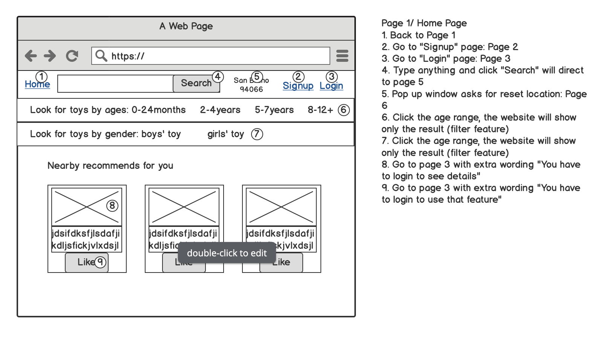
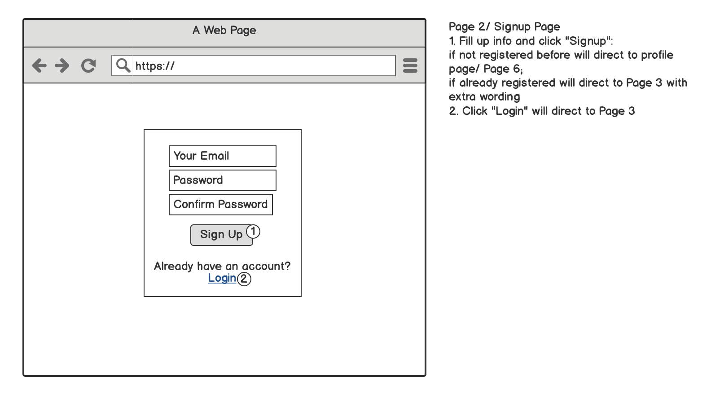
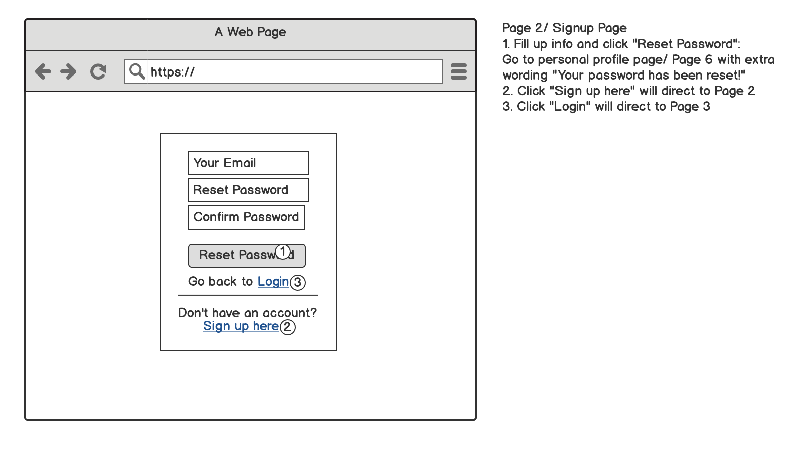
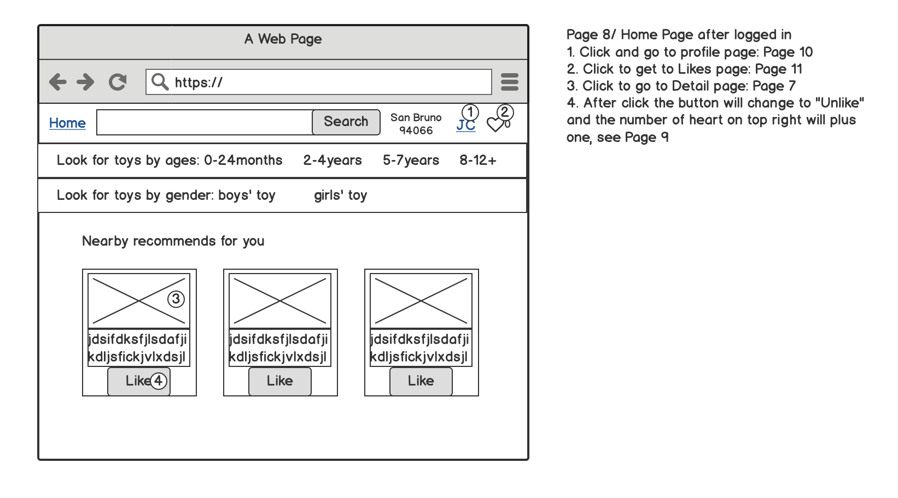
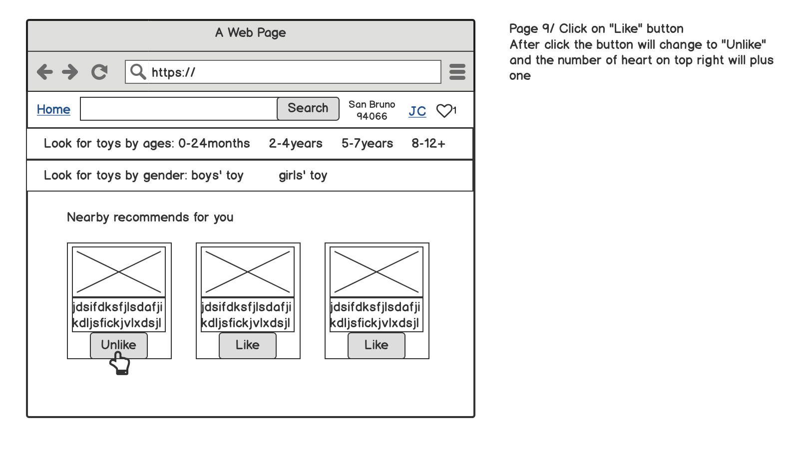
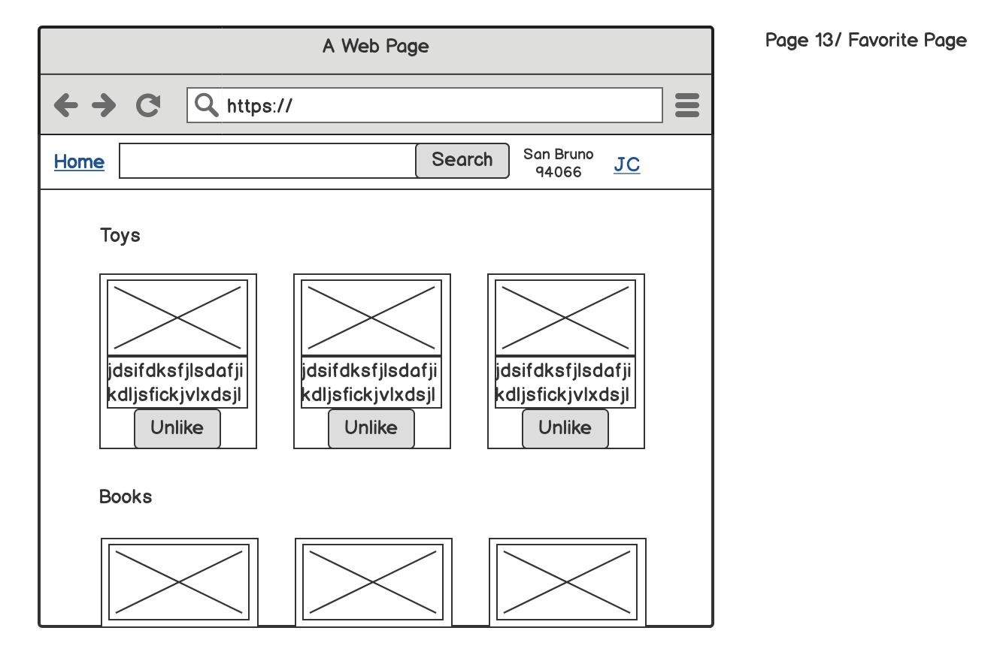
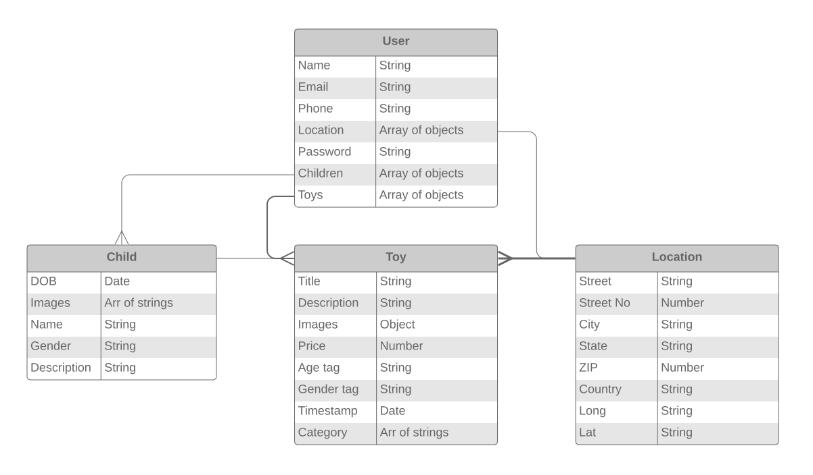

# Kidsbook

Kidsbook is an online marketplace for parents to buy and sell pre-loved children's toys locally.

## Index

* [User Stories](#User-Stories)
* [User Flow](#User-Flow)
* [Site Map](#Site-Map)
* [Wireframes](#Wireframes)
* [Data Models](#Data-Models)
* [Technologies](#Technologies)
* [Stretch Goals](#Stretch-Goals)
* [License](#License)

## User Stories

#### Shopping for toys

Site visitors will be able to enter their location and view a list of toys currently available for sale nearby.
They will be able to search inside this list of toys.

In the search results they will be able to see for each list item:
* an image
* a title
* location/distance
* price

When they click on a list item they will also see:
* more images
* item description
* age tag
* gender tag if appropriate

They will be able to take the following actions:
* contact seller
* navigate to seller profile in a new tab
* save item to list/cart
* view item list/cart

#### Selling toys

Site patrons looking to pass on some pre-loved children's toys will be able to set up a profile where they'll be able to create and keep track of their postings as well as create profiles of their children.

User profile will contain:
* name
* address/location
* email
* phone
* login & password

* option to view | add | edit | delete child profiles
* option to view | add | edit | delete toy postings

Children's profile can contain:
* name
* age
* gender
* description
* images

Toy postings can contain:
* title
* description
* images
* price
* age tag
* gender tag if relevant

## User Flow

See user flow on [gloomaps](https://www.gloomaps.com/wgvkaMos6a)

## Site Map

## Wireframes

## Data Models

See diagram on [lucidchart](https://www.lucidchart.com/invitations/accept/44d72878-61fc-4aa8-b688-39cc548fcfd6)

## Technologies

MongoDB | Mongoose | Express | Bootstrap | Node.js

## Stretch goals

* sort and filter search results by: 
	* distance
	* price
	* age
	* gender
	* recent posts
	* toy category
	* has images
	
* browse listings by:
	* category
	* age
	* gender
	
* online purchasing
	* cart
	* checkout
	
* timestamp posts
* toy rating
* condition (new, like new, good etc.)
* upload videos of kids playing with toy(s)
* borrow/rent/swap items
* map view
* seller ratings
* links to social media profiles

## License
[MIT](https://choosealicense.com/licenses/mit/)

===
[back to the top](#Kidsbook)
